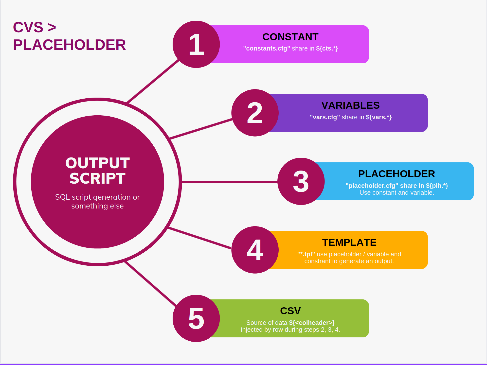

# node-csv-placeholder

( supports csv AND excel files :)  )

Have fun to complete boring tasks... With __Node-Csv-Placeholder__ !

## Getting started with ./test

Clone this project install it with ``npm install`` and try it with ``npm run test``.

This test will generate files in 'output' directory and a stdout.

## Configuration files

- ``constant.cfg`` : first step, you have access at nothing just helper declared in 'constant.js'.
- ``vars.cfg`` : second step, you have access to CSV data row by header name, constant, generated vars and Helper declared inside 'vars.js'.
- ``placeholder.cfg`` : third step, you have access to CSV data row by header name, vars, constant, generated placeholder _(no helper! this step is to use variable! or constant)_
- ``*.tpl`` : fourth step, you have access to CSV data row by header name, vars, constant, placeholder and Helper _(helper will be to create stype or rules of visibility for special item... or not)_

## Helpers to help us

Generation of constant, variable, placeholder and template needs basics function included by default here and easier to update/upgrade.

- ``constant.js > helper`` : helper in constant.js are static, csv and variable are not created during constant generation.
  - date : format a date with moment library
  - notEmpty: if item is not empty then returns value or empty string

- ``vars.js > Helper`` : Helper in vars.js are more dynamic with a lot of useful functions
  - get : to get something
  - getDataKey : to get  current RowIndex of CSV
  - format : to mix variable placeholder and javascript
  - math : chain a value with mathjs library
  - notEmpty : test if item is empty and return a value if not
  - trim : delete double space and trim value
  - switch : first array for testcase, second for value mapping if test is true like a switch
  
- ``placeholder.js > NO HELPER!``

- ``template.js > Helper`` : Template are used to order placeholder, add comments and  create the final script.

## Script Parameters

- __data:__
  - path of data file, support csv, excel (xls, xlsx) (see dataOpt parameters to customize data file parser)
  - alias: 'd'
- __dataOp:__
  - options for data parser, multiple [dataOpt] parameters accepted.
  - alias: 'D'
- __vars:__
  - path of vars file ./test/vars.cgf.
  - alias: 'v'
- __constant:__
  - path of constant file ./test/constant.cfg.
  - alias: 'c'
- __template:__
  - path of template file ./test/template.tpl, multiple template are accepted just add a "--template" per file.
  - alias: 't'
- __placeholder:__
  - path of placeholder file ./test/placeholder.cfg.
  - alias: 'p'
- __clean:__
  - clean target path before rendering, active by default.
  - alias: 'r'
- __output:__
  - target path where generated file will be created.
  - alias: 'o'
- __outputext:__
  - extension of generated files
  - alias: 'e'
- __stdoutput:__
  - enable/disable console log for template rendering, active by default.
  - alias: 's'
- __allinone:__
  - enable/disable "all-in-one" generation file, active by default.
  - alias: 'a',
